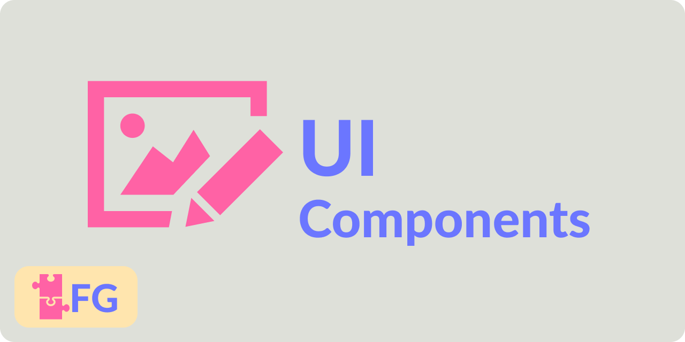

# UI Components

A set of UI components for Unity's new UI Toolkit framework. [View On GitHub](https://github.com/faster-games/ui-components) 🎛🖊 




[](https://openupm.com/packages/com.faster-games.ui-components/)
[](https://github.com/faster-games/ui-components/actions/workflows/main.yml)
[](https://discord.gg/QfQE6rWQqq)

The new Unity UI Toolkit provides a browser-like way to create UI in Unity Games. However, this core set of tools doesn't come with much. As a result, I wanted to create a set of primitives I could reuse to reduce boilerplate. This is that set.

## Installing

This package supports [openupm](https://openupm.com/packages/com.faster-games.ui-components/) - you can install it using the following command:

```
openupm add com.faster-games.ui-components
```

Or by adding directly to your `manifest.json`:

> Note: You may also use specific versions by appending `#{version}` where version is a [Release tag](https://github.com/faster-games/ui-components/releases) - e.g. `#v1.2.0`.

```
dependencies: {
	...
	"com.faster-games.ui-components": "git+https://github.com/faster-games/ui-components.git"
}
```

Or by using [Package Manager](https://docs.unity3d.com/Manual/upm-ui-giturl.html) to "Add a package from Git URL", using the following url:

```
https://github.com/faster-games/ui-components.git
```

## Documentation

<center>

[Manual 📖](https://ui-components.faster-games.com/manual/getting-started.html) | [Scripting API 🔎](https://ui-components.faster-games.com/ref/FasterGames.UI.Components.html)

</center>


### Quickstart

- Learn about [UI Toolkit](https://docs.unity3d.com/Manual/UIElements.html).
- Leverage these components in your UI.

## Supporting the project

If this project saved you some time, and you'd like to see it continue to be invested in, consider [buying me a coffee. ☕](https://www.buymeacoffee.com/bengreenier) I do this full-time, and every little bit helps! 💙
