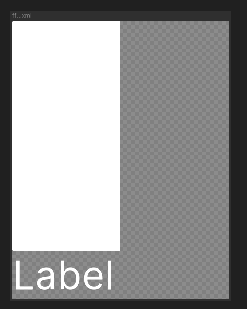

# Getting Started

Some tips and tricks on how to begin using UI Components.

## Quick Examples

### A simple bar example

```
<ui:UXML xmlns:ui="UnityEngine.UIElements" xmlns:uie="UnityEditor.UIElements" xmlns:u="FasterGames.UI.Components" editor-extension-mode="False">
    <u:VBox>
        <u:Bar value="50" />
        <ui:Label text="Label" style="font-size: 64px;" />
    </u:VBox>
</ui:UXML>
```

Here we alias `FasterGames.UI.Components` to `u` for simpler use. We then define a basic HUD that looks like this:



Note that this is with the `Runtime/Themes/Default` theme applied. Your themes can derive from this.

You can try it out by loading this into a `uxml` file, and opening that file with [UI Builder](https://docs.unity3d.com/Manual/com.unity.ui.builder.html) to preview it.
